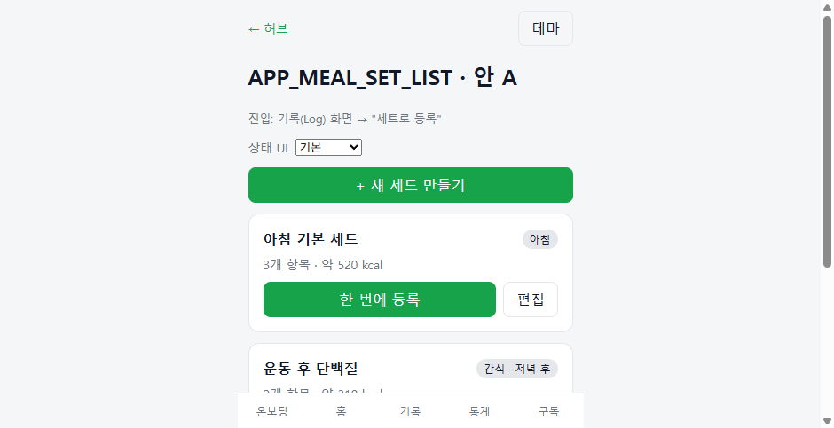
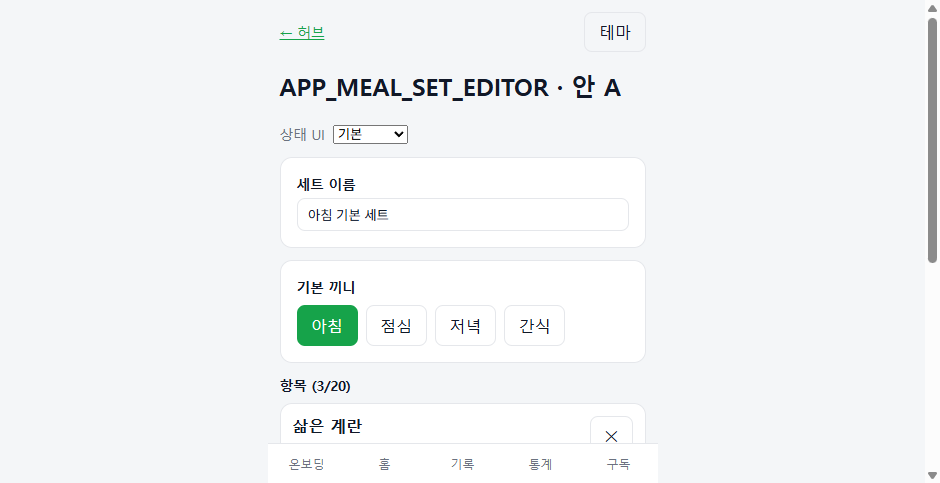
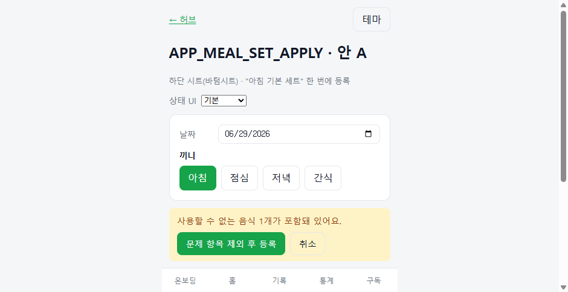
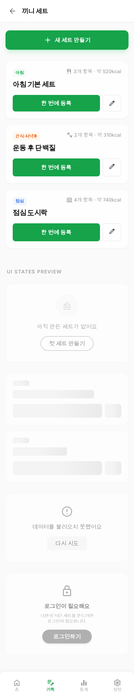
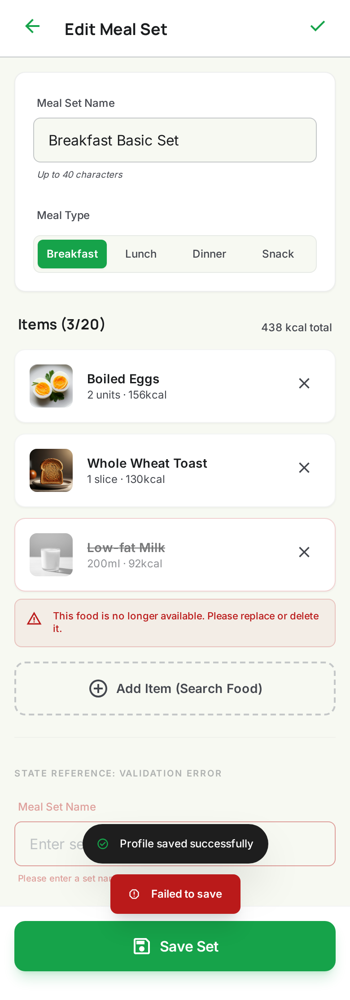
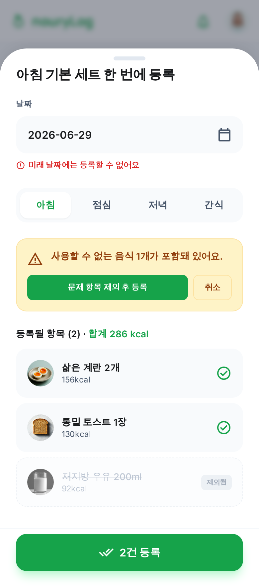

# 끼니 세트(즐겨찾기 묶음) 이중 디자인안 — 비교·선택

> 근거 PRD: [`docs/requirements/feature-mobile-meal-set-prd.md`](../requirements/feature-mobile-meal-set-prd.md) (Gate 1 승인 2026-06-29).
> 본 문서는 `65-design-gate.mdc`의 **이중 디자인안 + 선택 기록** 요구를 충족하기 위한 산출물이다.
> 디자인 승인(HUMAN) 전까지 제품 구현·병렬 구현으로 넘어가지 않는다.

## 1. 범위 (동일 입력)

두 안 모두 같은 요구·상태 스펙으로 작성했다. MVP 화면 3개:

| 화면 | 목적 |
|---|---|
| MealSetList | 끼니 세트 목록, "한 번에 등록"/"편집" 진입 |
| MealSetEditor | 세트 이름·기본 끼니·항목(템플릿) 편집 |
| MealSetApplySheet | 날짜·끼니 지정, 미리보기, 사용 불가 항목 제외 후 일괄 등록 |

공통 상태 스펙: 기본 / 로딩 / 빈 데이터 / 오류 / 권한 제한 / 완료. 모바일 단일 컬럼, 다크모드 지원, 초록(#16a34a) 강조.

## 2. 안 A — 로컬 목업 (자체)

- 위치: `mock-internal` React 앱, 라우트 `/app/meal-set`, `/app/meal-set/edit`, `/app/meal-set/apply`
- 실행: `cd mock-internal && npm run dev` → 허브(`/`)에서 "APP_MEAL_SET_*" 링크
- 특징: `StatePicker`로 6개 상태를 실시간 전환 가능. 제품 mock-internal 컴포넌트/토큰(card, btn, banner, badge)을 그대로 사용 → 제품 코드와 시각·구조 정합. tsc 타입체크 통과.

| 목록 | 편집 | 한 번에 등록 |
|---|---|---|
|  |  |  |

(스크린샷은 상단 영역만 표시. 하단 상태·항목은 앱 내 스크롤/StatePicker로 확인)

## 3. 안 B — Stitch

- 프로젝트: `projects/7726060931590277332` (Diet Management — dual mockup B)
- 디자인 시스템: `assets/1329886661735568102` (DietManagement DS v1, Manrope/Inter, #16a34a, ROUND_EIGHT)
- 화면 리소스 ID:
  - 목록: `projects/7726060931590277332/screens/34b3dcf835cc42f5839ff60c07041e51`
  - 편집: `projects/7726060931590277332/screens/a4c671db0dd14dcb9aa92ee0f98764d5`
  - 한 번에 등록: `projects/7726060931590277332/screens/1049246405b542c6af66868e032e46e1`

| 목록 | 편집 | 한 번에 등록 |
|---|---|---|
|  |  |  |

## 4. 비교표

| 기준 | 안 A (로컬 목업) | 안 B (Stitch) |
|---|---|---|
| 시각 완성도 | 중. 기능적 와이어 수준 | 상. 아이콘·썸네일·여백 등 시각 디테일 우수 |
| 제품 코드 정합 | 상. 실제 컴포넌트/토큰 재사용, 그대로 이식 용이 | 중. Tailwind 산출물 → RN 변환 필요(시각 참조용) |
| 상태 UI 적합성 | 상. 6개 상태 인터랙티브 전환, 분기 검증 쉬움 | 중. 한 화면에 상태들을 정적 나열(참조용) |
| 다크모드 | 상. 토글로 즉시 검증(테마 버튼) | 중. 라이트 시드, 다크는 명세상 지원 |
| 구현 난이도 | 낮음(이미 RN 패턴과 동일) | 보통(레이아웃 참조 후 재구성) |
| 갱신 비용 | 낮음(코드 직접 수정) | 보통(재생성/편집 호출) |
| 강점 | 정합성·상태 검증·바로 이식 | 비주얼 설득력·간격/타이포 완성도 |
| 리스크 | 비주얼이 다소 밋밋 | 픽셀을 그대로 구현하려다 RN과 괴리 가능 |

## 5. 추천안

**추천: 안 B의 비주얼(간격·타이포·아이콘·항목 썸네일·배지 톤)을 기준 시안으로 채택하되, 구현 정합·상태 분기는 안 A 구조를 토대로 한다.**

- 본 기능은 기존 제품(React Native, mock-internal 토큰)과 동일 스택으로 구현된다. 안 A가 상태 분기·다크모드·이식성에서 우위라 구현 리스크가 낮다.
- 다만 시각 완성도는 안 B가 분명히 앞선다. 따라서 **시각 기준 = 안 B, 구조·상태·이식 기준 = 안 A** 조합을 권장한다.
- 단일 안만 골라야 한다면 **안 B 채택 + 안 A의 상태 전환/이식성을 구현 가이드로 병기**를 추천한다.

## 6. 선택 기록 (HUMAN)

- 최종 선택안: **안 A (로컬 목업)** — 2026-06-29 사용자 승인.
- 채택 사유: 기존 제품과 동일 스택(React Native + mock-internal 토큰)으로 구현 정합·이식성이 높고, 6개 상태 분기와 다크모드를 인터랙티브로 검증할 수 있어 구현 리스크가 낮음.
- 제외안(안 B) 사유: 시각 완성도는 높으나 Tailwind 산출물이라 RN 변환 비용이 있고 상태 분기가 정적 나열이라 구현 기준 시안으로는 안 A가 적합. 단, **간격·타이포·항목 썸네일·배지 톤 등 시각 디테일은 안 B를 참조**한다.
- 수정 지시: 없음.

> 디자인 승인 완료(= 구현 착수 승인). PRD §15에 반영하고 Gate 2(API 계약 고정 + ATDD-lite RED) 후 구현에 착수한다.
