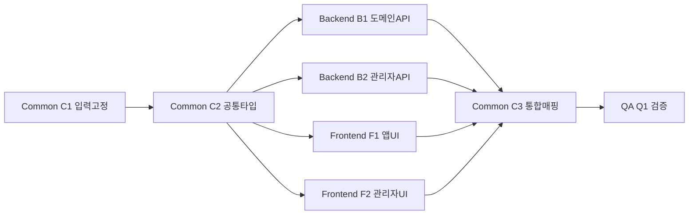

# 식단 관리 구현 분할 계획 v1 (Gate 2)

## 0) 고정 입력
- API 계약(고정): `docs/requirements/feature-diet-management-api-contract-v1.md` (`v1-fixed`)
- 상태 UI(고정): `docs/requirements/feature-diet-management-state-mapping.md` (`v1 fixed`)
- 디자인 선택안: Stitch 기반 (`docs/design/diet-management-mockup-b-stitch.md`)

## 1) 역할 분담 (AGENTS.md 기준)
- `backend-agent`: API/서비스/오류 포맷/멱등·배치·권한 처리 담당 (계약 준수 중심)
- `frontend-agent`: 앱/관리자 화면 상태 UI 구현 및 API 응답 매핑 담당 (상태 매핑 준수)
- `design-system-agent`: 토큰/다크모드/상태 컴포넌트 시각 일관성 점검
- `qa-agent`: 요구사항 대비 회귀/상태/권한 시나리오 검증
- **Integration Owner:** 메인 에이전트 (계약·상태·UI 정합 최종 판단)

## 2) 트랙 분할

### Track A — Backend Contract Lock 구현
- 범위
  - 앱 API(`meals`, `ocr`, `stats`, `billing`) 응답/오류 코드 고정 반영
  - 관리자 API(`dashboard`, `users/foods/inquiries/notices`) 15개 페이지네이션 규약 반영
  - `POST /admin/stats/reaggregate` 동작 및 stale 기준 필드(`isStale`, `staleHours`) 보장
- 완료 기준
  - 계약 문서의 필수 필드 누락 없음
  - 오류 코드가 카탈로그와 1:1 매핑

### Track B — Frontend State UI 구현
- 범위
  - 앱: 기록(OCR 4회 배너/5회 페이월), 통계(stale/타임존), 구독(`premium_monthly`, restore)
  - 관리자: 대시보드 재집계 버튼, 목록형 4종 필터/15행/중앙 페이지네이션
  - 공통 상태: 기본/로딩/빈/오류/권한(필요 시 완료) 화면 반영
- 완료 기준
  - 상태 매핑 문서의 화면별 상태가 실제 UI에 모두 존재
  - 에러 코드별 사용자 행동(재시도/이동/전환)이 명확

### Track C — Design/System 정합
- 범위
  - Stitch 선택안의 톤/간격/토큰 반영
  - 라이트/다크 전환 및 저장 전략 확인
- 완료 기준
  - 주요 화면 다크 모드 대비·가독성 문제 없음

### Track D — QA/검증
- 범위
  - OCR 무료 쿼터 경계값(4회/5회), stale 임계(6h), 권한(401/403), 목록 필터 유지
  - 회귀 테스트 + 상태 UI 누락 점검
- 완료 기준
  - 치명/주요 버그 0, 잔여 리스크 문서화

## 3) 병렬 가능 여부 및 충돌 주의
- **병렬 가능:** Track A(백엔드) ↔ Track B(프론트) 동시 진행 가능
- **병렬 조건 충족(Gate 2):**
  - API 계약 고정 완료
  - 상태 UI 정의 고정 완료
  - 디자인 선택안 확정 완료(Stitch)
- **파일 충돌 주의:**
  - `shared/types`, 에러 코드 상수, API client DTO에서 충돌 가능
  - 해결 원칙: 계약 문서를 SSOT로 두고 Integration Owner가 병합 판단
- **통합 체크포인트(매일):**
  - DTO 필드/enum diff 점검
  - 상태 UI 라벨/카피와 코드 매핑 점검

## 4) 실행 순서(권장)
1. Track A/B 착수 전 공통 타입 스냅샷 생성
2. Track A/B 병렬 구현
3. Track C 디자인 정합 패치
4. Track D QA 검증 및 잔여 리스크 정리

## 5) 공통/백엔드/프론트 의존관계

### 5.1 작업 단위 정의
- **Common-C1 (선행 고정):** 계약/상태/디자인 입력 고정 확인
- **Common-C2 (공통 타입):** `shared/types`, 에러 코드 enum, API DTO 스냅샷
- **Backend-B1 (도메인 API):** `meals`, `ocr`, `stats`, `billing`
- **Backend-B2 (관리자 API):** `dashboard`, `users/foods/inquiries/notices`, `reaggregate`
- **Frontend-F1 (앱 UI):** 기록/OCR/통계/구독 상태 UI
- **Frontend-F2 (관리자 UI):** 필터·테이블·페이지네이션·권한 UI
- **Common-C3 (통합):** API client 생성/갱신, FE-BE 계약 매핑 점검
- **QA-Q1 (검증):** 경계값·권한·회귀·다크모드 검증

### 5.2 의존관계(선후행)
- `C1 -> C2` (입력 고정 후 공통 타입 확정)
- `C2 -> B1`, `C2 -> B2` (백엔드 구현은 공통 타입 기반)
- `C2 -> F1`, `C2 -> F2` (프론트 상태 UI 스켈레톤/바인딩 기준)
- `B1 -> C3`, `B2 -> C3` (API 실제 응답/오류 포맷 반영)
- `F1 -> C3`, `F2 -> C3` (프론트 매핑/핸들러 결선)
- `C3 -> Q1` (통합 완료 후 QA 시작)

### 5.3 병렬 가능 구간
- **병렬 1:** `B1 || B2` (도메인/관리자 API 병렬)
- **병렬 2:** `F1 || F2` (앱/관리자 UI 병렬)
- **교차 병렬:** `B1/B2`와 `F1/F2`는 병렬 가능하되, `C3` 이전에 계약 불일치가 없어야 함

### 5.4 통합 게이트(필수)
- **Gate-I1 (타입 게이트):** `C2` 완료 시점에 DTO/enum freeze 태그 부여
- **Gate-I2 (계약 게이트):** `C3`에서 엔드포인트별 request/response/error 1:1 매핑 확인
- **Gate-I3 (릴리즈 게이트):** `Q1` 통과 + 잔여 리스크 문서화

### 5.5 충돌 위험과 책임
- **고위험 충돌 파일군:** `shared/types`, API client, 에러 코드 상수, 상태 라벨 상수
- **책임:** Integration Owner가 충돌 우선순위 결정(SSOT: API 계약 문서)
- **해결 원칙:** 프론트 임시 우회 금지, 계약 수정 또는 백엔드 수정 중 하나로 단일화

### 5.6 의존관계 다이어그램

## 6) DoD
- 요구사항/계약/상태 UI/구현 일치
- 웹/앱·반응형·다크모드 영향 점검 완료
- QA 결과 및 남은 리스크 기록 완료
